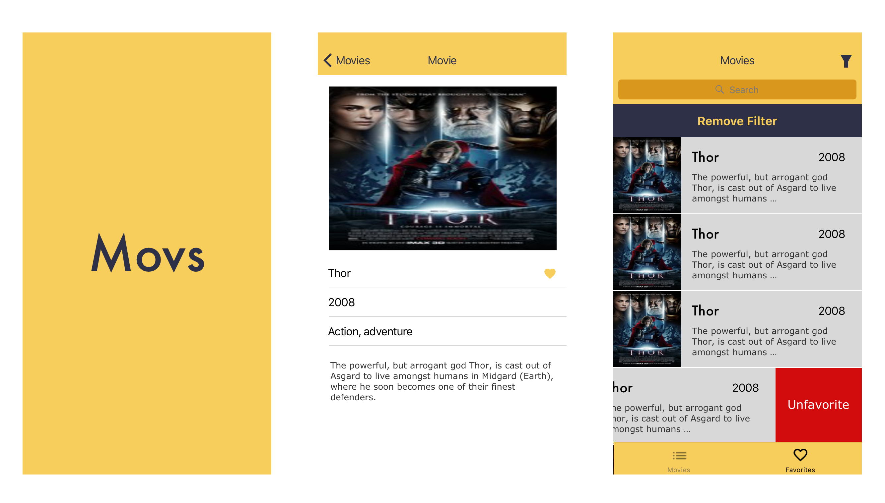

# Concrete iOS Recruit Challenge #

### Bem vindo

Primeiramente, obrigado por participar do desafio iOS da Concrete. Estamos muito contentes por você estar se propondo a dar o primeiro passo para fazer parte de um time excepcional.

## Afinal, o que é esse desafio?

Você deverá criar uma app sobre filmes, usando a  [API](https://developers.themoviedb.org/3/getting-started/introduction) do [TheMovieDB](https://www.themoviedb.org/?language=en). Legal certo ? Para dar uma padronizada e ter um layout minimamente definido anexamos alguns assets que vão te ajudar a desenvolver esse app!

-  [Icones do app](assets/appIcons)
-  [ScreenShots](assets/screenshots)
-  [Icones](assets/icons)

Pense no desafio como uma oportunidade de mostrar todo o seu conhecimento. Faça o mesmo com calma você tem uma semana para entregar o mesmo.

Pensamos nesse desafio como uma oportunidade para você nos mostrar como lida com casos de:

- Consumo de APIs
- Persistência de dados (Favoritos)
- Lógicas de filtros e buscas.
- Estrutuação de layout e fluxo de aplicação.

O unico pré requisito é o código seja feito em Swift, de preferência na versão mais atual. Sinta-se a vontade para:
- usar ou não bibliotecas
- estruturar seu layout com storyboards, xibs ou ViewCode
- Adotar a arquitetura que você quiser.

Somos especialmente preocupados com qualidade e acreditamos bastante em testes automatizados, entendemos que não é um tópico dominado por todos e aceitamos desafios com todos os perfis e diferentes momentos de experiencia e conhecimento técnico. Porém para posições mais Seniors damos muito importância para a qualidade do código.

**Gostariamos** de fazer um agradecimento especial para todas as empresas que tem utilizado o nosso desafio para seus reespectivos processos de seleção. Obrigado pela confiança e reconhecimento! =)

# Features ..

### Precisa ter:

- Tela de Splash
- Layout em abas contendo na primeira aba a tela de grid de filmes e na segunda aba a tela de lista de filmes favoritados no app.
- Tela de grid de filmes trazendo a lista de filmes populares da [API](https://developers.themoviedb.org/3/movies/get-popular-movies).
- Tratamento de erros e apresentação dos fluxos de exceção: Busca vazia, Error generico, loading.
- Ao clicar em um filme do grid deve navegar para a tela de detalhe do filme.
- Tela de Detalhe do filme deve conter ação para favoritar o filme.
- Tela de Detalhe do filme deve conter genero do filme por extenso (ex: Action, Horror, etc). Use esse [request](https://developers.themoviedb.org/3/genres/get-movie-list) da API para trazer a lista. Pense em uma maneira de otimizar esse request de generos para não precisar repetir o mesmo para cada detalhe de filme.
- Tela de lista de favoritos persistido no app entre sessões.
- Tela de favoritos deve permitir a desfavoritar um filme.

### Ganha mais ponto se tiver:

- Tela de grid de filmes deve conter busca local.
- Scroll Infinito para fazer paginação da api de filmes populares.
- Celula do Grid de filmes com informação se o filme foi favoritado no app ou não.
- Tela de filtro com seleção de data de lançamento e genêro. A tela de filtro só é acessivel a partir da tela de favoritos.
- Ao Aplicar o filtro devemos retornar a tela de favoritos e fazer um filtro local usando as informações selecionadas referentes a data de lançamento e genêro.
- Testes unitários no projeto.
- Testes funcionais.
- Pipeline Automatizado

# Exemplos e sugestões

Abaixo podemos ver algumas telas de exemplo de alguns desses fluxos. As mesmas são apenas sugestões, se sinta livre para modifica-las conforme vontade.

Fornecemos os assets, app icons, icones e paleta de cores para facilitar o processo. Se o seu lado designer falar mais alto sinta-se a vontade para nos surpreender!

### Fluxo de grid de filmes

### Fluxo com Splash, Tela de Detalhes e tela de lista da favoritos

### Fluxo Opcional de filtro

## **Processo de submissão** ###

O candidato deverão implementar a solução e enviar um pull request para este repositório.

O processo de Pull Request funciona da seguinte maneira:

1. Candidato fará um fork desse repositório (Não irá clonar direto!)
2. Fará seu projeto nesse fork.
3. Commitará e subirá as alterações para o __SEU__ fork.
4. Pela interface do Bitbucket, irá enviar um Pull Request.

Se possível deixar o fork público para facilitar a inspeção do código.

### **ATENÇÃO** ###

Não se deve tentar fazer o PUSH diretamente para ESTE repositório!
